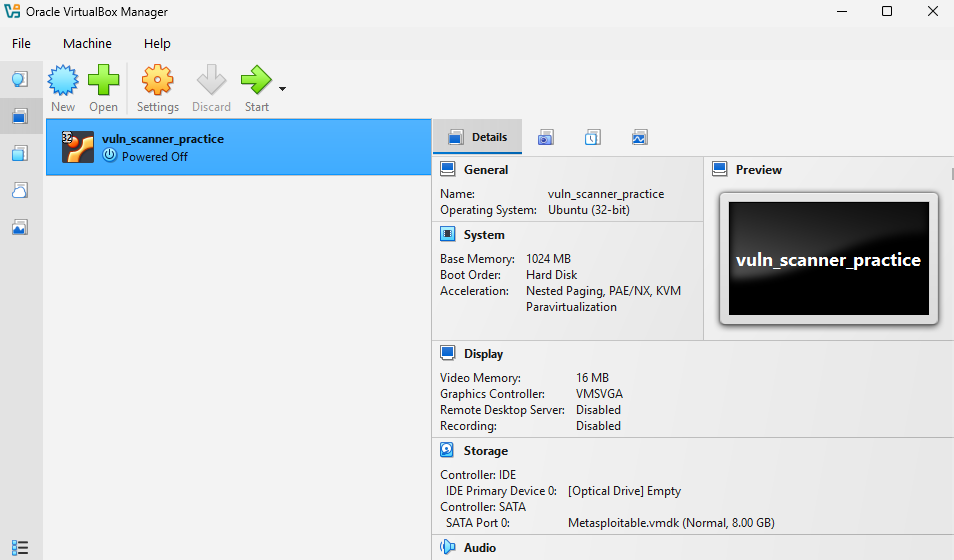
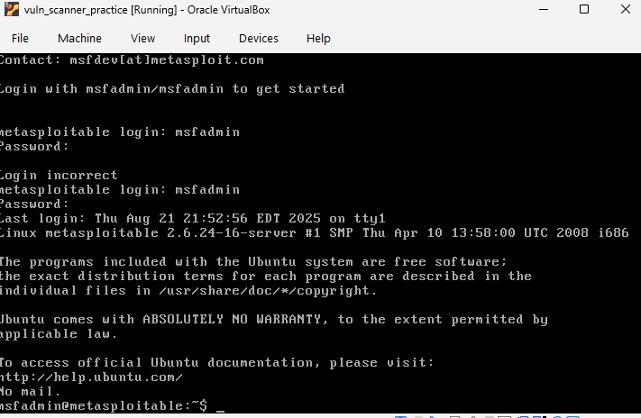
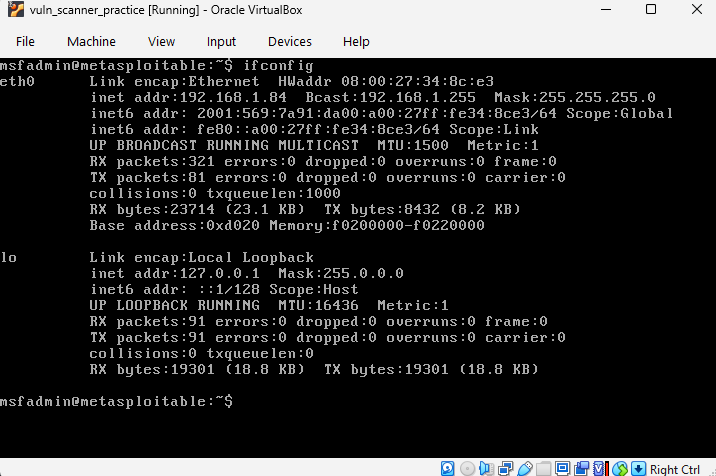
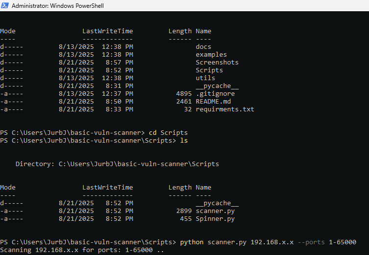
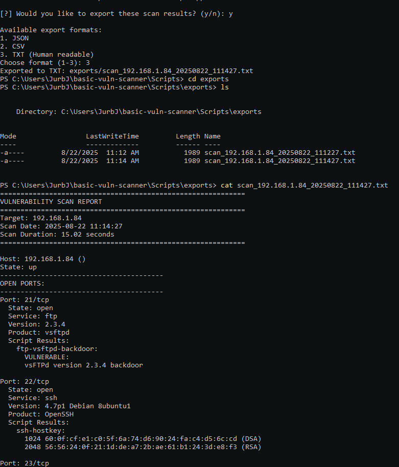

# Basic Vulnerability Scanner

## Overview
A Python-based network security scanner that leverages `nmap` and Python's `socket` library to perform comprehensive security assessments. The tool provides automated detection of network vulnerabilities and service misconfigurations.

## Features
- IP range scanning for open port discovery
- Service enumeration and version detection
- Common misconfiguration identification
- CVE database integration (planned)
- Automated vulnerability assessment reporting

## Installation
```bash
git clone https://github.com/<KeirPar>/basic-vuln-scanner.git
cd basic-vuln-scanner
pip install -r requirements.txt
```

## Usage
```bash
python scanner.py  <target_ip> -p <port_range>
python scanner.py --help  # For full options
```

## Technical Requirements
- Python 3.7+
- nmap installed and accessible in PATH
- Required Python packages listed in requirements.txt

## Practicing/Testing

### Recommended Practice Setup

#### Using Metasploitable for Learning
The safest way to practice vulnerability scanning is by using intentionally vulnerable systems in an isolated environment:

1. **Download Metasploitable 2**:
   ```bash
   # Download from SourceForge or Rapid7
   wget https://sourceforge.net/projects/metasploitable/files/Metasploitable2/metasploitable-linux-2.0.0.zip
   ```

2. **VM Setup**:
   - Install VirtualBox or VMware
   - Import Metasploitable as a virtual machine
   - Configure network settings to "Host-Only" or "Internal Network" to isolate from your main network
   - Default credentials: `msfadmin:msfadmin`

3. **Practice Scenarios**:
   ```bash
   # Scan the Metasploitable VM
   python scanner.py 192.168.x.xx
   
   # Target specific vulnerable services
   python scanner.py 192.168.x.xx --ports 21,22,23,25,80,139,445
   ```

## Screenshots

**Setting up the VirtualBox**



**Logging into Metasploitable**



**Checking ifconfig: Shows your network interface configuration and status information:**



Testing using Windows PowerShell
**NOTE: Must run PowerShell as an administrator; otherwise, the VM does not allow you to use nmap to scan it.**




**Exporting to txt (can also export to CSV or JSON)**




## Security Considerations
This tool is intended for authorized security testing only. Ensure you have proper permission before scanning any network infrastructure. Unauthorized network scanning may violate local laws and organizational policies.
